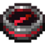

<h1>
  
  EncompassSMP
</h1>

A Minecraft scripted server with plenty of freedom, allowing players to create their own stories while taking part in larger server events and lore.

<h2>About</h2>

EncompassSMP combines scripted storytelling with free-range survival gameplay. While the server features an overarching narrative centered around four main characters, players are free to build, explore, form alliances, create rivalries, and shape the world in their own way.

<h2>Main Characters</h2>

<ul>
  <li>FryedCheese</li>
  <li>RogueGhost</li>
  <li>EstellaTheEntity</li>
  <li>Lumi_The_Ghost</li>
</ul>

<h2>Features</h2>

<ul>
  <li>Scripted lore and story events</li>
  <li>Player-driven adventures</li>
  <li>Survival gameplay</li>
  <li>Community events</li>
  <li>Freedom to build and explore</li>
  <li>Custom server contents</li>
</ul>

<h2>Join the Story</h2>

Whether you want to become a legendary builder, a powerful ruler, a wandering explorer, or a key part of the server's lore, EncompassSMP gives you the freedom to create your own path.

